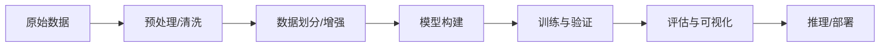
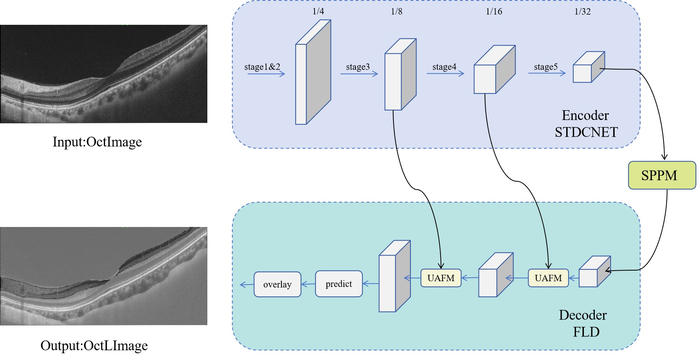
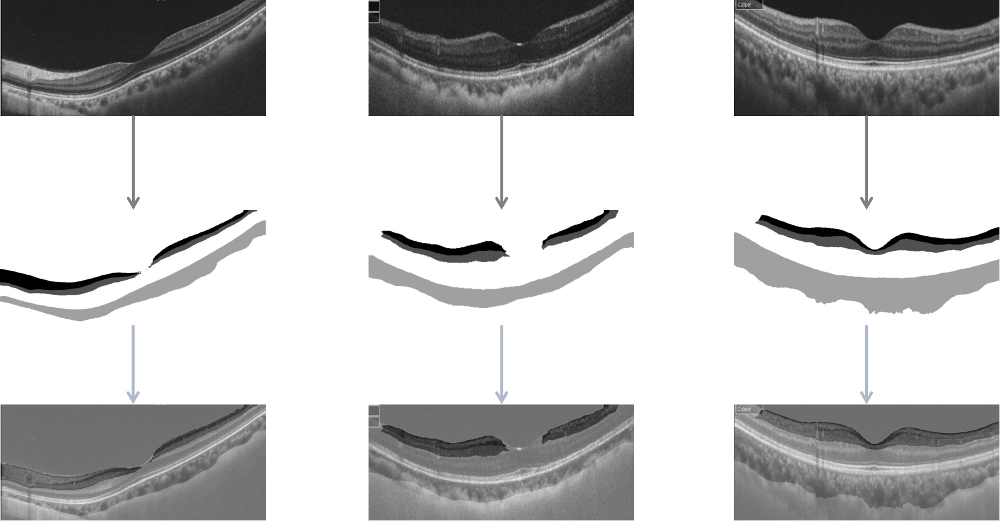
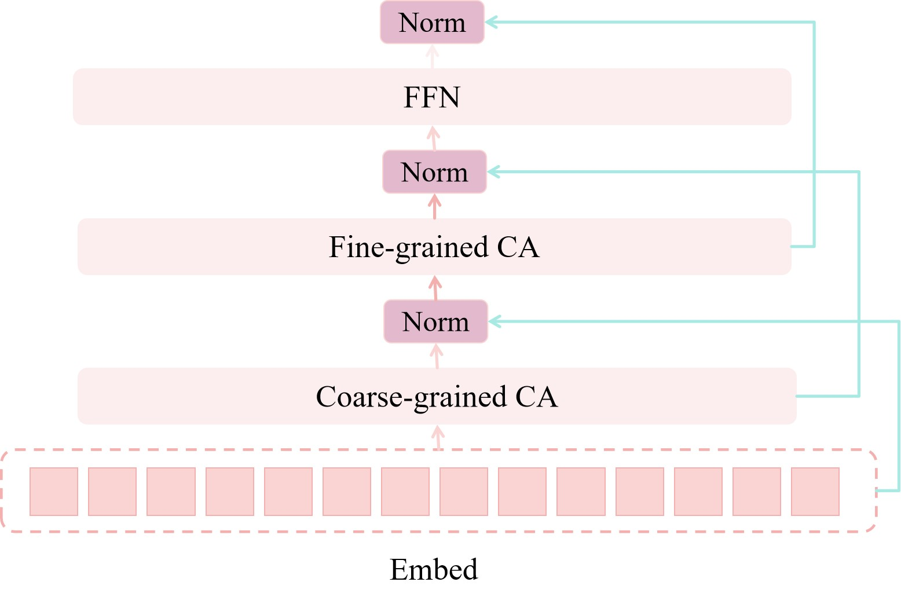
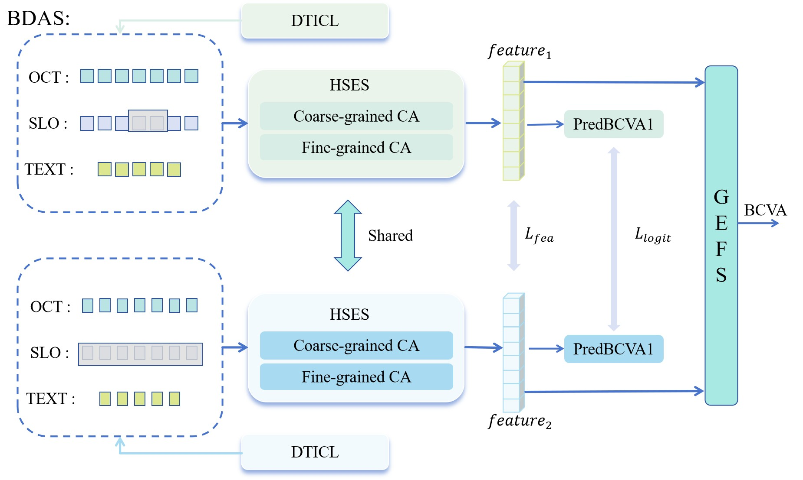
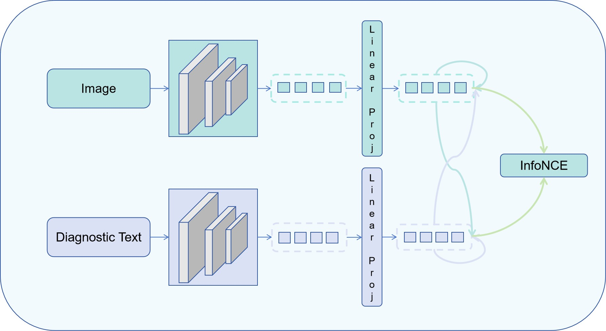
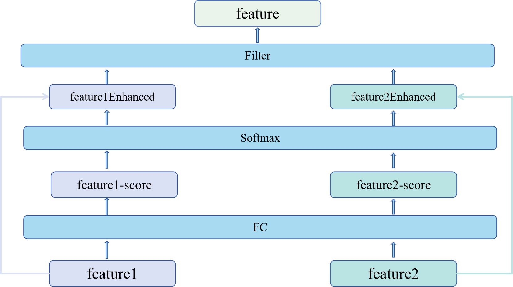

# BDAS 项目

> 一图一节，带你从 **预处理 → 模型 → 训练 → 评估 → 推理部署** 走一遍完整流程

---

## 目录

* [快速开始](#快速开始)
* [流程总览](#流程总览)
* [1. 数据预处理](#1-数据预处理)
* [2. 数据集划分与增强](#2-数据集划分与增强)
* [3. 模型结构](#3-模型结构)
* [4. 训练与超参](#4-训练与超参)
* [5. 评估指标与可视化](#5-评估指标与可视化)
* [6. 推理与部署](#6-推理与部署)
* [项目结构](#项目结构)


---

## 快速开始

```bash
# 克隆并进入项目（示例）
# git clone https://github.com/yiayi27/BDAS.git
cd visionPred

# 安装依赖
pip install -r requirements.txt

# 训练
python main.py

# 测试/评估
python test.py
```

---

## 流程总览



---

## 1. 数据预处理

> 针对白内障患者术后视力预测的任务，我们采用OCT,SLO,Text三种模态数据来做回归预测。其中SLO模态存在约2/3的模态缺失。



**要点**

* 为了进一步增强OCT图像的层次结构，便于提取OCT图像特征，我们使用优秀的pplite_seg进行OCT图像的层分割模型，分割结果如图：



---

## 2. 数据集划分与增强

> 训练/验证/测试划分
* 我们使用8:1:1的比例划分数据集

> 我们对OCT，SLO这两个图像模态进行粗细粒度相结合的特征提取



> 我们对Text模态使用bert进行特征提取（其中text包含患者的结构化病理信息，对OCT,SLO图像的医学专业分析）


## 3. 模型结构

> BDAS整体模型结构图



> 图像-文本对比学习模块



> 自监督学习模块




## 4. 训练与超参

> 配置见requirements.txt文件

## 5. 评估指标与可视化

> 使用MAE作为评价指标，更多使用方法欢迎继续改进哦

## 6. 推理与部署

> 由于数据集并非开源，暂无适合的训练模型可以开源出来，作者会继续努力做的

## 项目结构

```text
visionPred/
├─ README.md
├─ requirements.txt
├─ main.py
├─ test.py
├─ configs/
├─ dataloader/
├─ loss/
├─ model/
├─ utils/
└─ images/                 
   
---

## 环境与安装

* Python：3.9+（示例）
* 关键依赖：`torch` / `torchvision` / `scikit-learn` / `numpy` / `pandas` …
* 一键安装：

```bash
pip install -r requirements.txt
```


